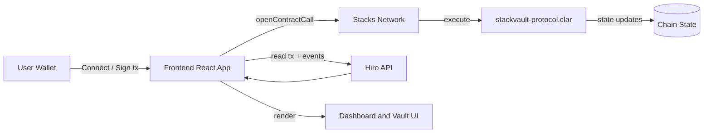
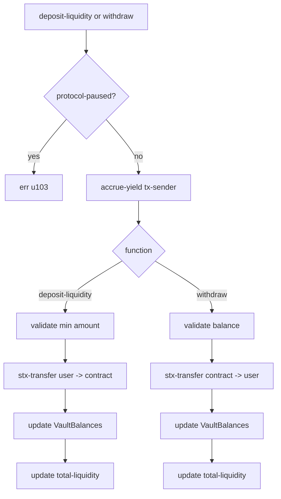
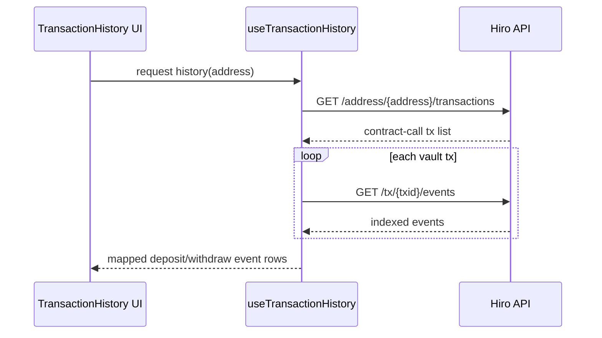

# StackVault Protocol

StackVault is a Stacks-based liquidity vault protocol where users deposit and withdraw STX while balances accrue yield over block time. This repository contains:

- Clarity smart contracts for vault operations and yield accounting.
- A React + Vite frontend for wallet connection, vault management, and analytics.
- Clarinet tests validating protocol behavior and edge cases.

## Architecture

### High-level system



### On-chain contract flow



### Frontend data flow for indexed events



## Repository layout

```text
contracts/
   stackvault-protocol.clar   # primary protocol contract
   vault.clar                 # basic vault example contract
src/
   components/                # dashboard, vault, history, UI primitives
   hooks/                     # wallet, vault metrics, tx form/history hooks
tests/
   stackvault-protocol_test.ts
   vault_test.ts
```

## Smart contract details

### Main contract: stackvault-protocol.clar

Core state:

- data-var total-liquidity: tracks aggregate vault liquidity in micro-STX.
- data-var protocol-paused: admin pause switch.
- map VaultBalances: per-principal state with:
   - amount
   - last-reward-height

Yield model:

- APY is fixed at 5.00% (YIELD-APY u500, precision u10000).
- Accrual is block-based using BLOCKS-PER-YEAR u52560.
- Yield is checkpointed by accrue-yield before balance-mutating actions.

Public functions:

- deposit-liquidity(amount):
   - validates protocol is active
   - checkpoints yield
   - enforces minimum deposit of 1 STX
   - transfers STX user -> contract
   - updates user balance and total liquidity
- withdraw(amount):
   - validates protocol is active
   - checkpoints yield
   - enforces sufficient balance
   - transfers STX contract -> user
   - updates user balance and total liquidity
- claim-yield():
   - validates protocol is active
   - checkpoints yield without deposit/withdraw
- pause-protocol() / resume-protocol():
   - owner-only protocol controls

Read-only functions:

- get-balance(user): current balance + uncheckpointed yield
- get-accrued-yield(user): computed but not yet checkpointed yield
- get-total-liquidity(): global liquidity
- is-protocol-paused(): pause status

Error codes:

- u100: not authorized
- u101: insufficient funds
- u102: minimum deposit is 1 STX
- u103: protocol paused

### Secondary contract: vault.clar

vault.clar is a simpler reference vault contract included for experimentation and comparison. The frontend and primary tests are centered on stackvault-protocol.clar.

## Developer setup guide

### Prerequisites

1. Node.js 18+ (recommended)
2. npm 9+
3. Clarinet CLI

### 1) Install dependencies

```bash
npm install
```

### 2) Run frontend locally

```bash
npm run dev
```

Helpful scripts:

- npm run build: type-check and production build
- npm run preview: preview built app
- npm run lint: lint TypeScript/React code

### 3) Run smart contract tests

```bash
clarinet test
```

What current tests cover:

- deposit and withdrawal success paths
- minimum deposit validation
- insufficient balance handling
- multi-user state correctness
- yield accrual over simulated blocks
- pause/unpause behavior and gated writes

### 4) Contract-local analysis

Clarinet project settings are defined in Clarinet.toml, including contract paths and analysis options.

## Runtime notes

- Frontend contract calls currently target Stacks testnet network settings.
- History UI uses indexed data from Hiro API endpoints and maps contract events for deposits/withdrawals.
- Amounts are handled in micro-STX on-chain and converted to STX in UI.

## Security and operational considerations

- The owner is set from tx-sender at deploy time in current contract code.
- There is no dynamic APY governance mechanism in this version.
- Pause functionality blocks mutating actions but not read-only views.
- Always audit before production deployment.

## Troubleshooting

- If wallet connect fails, verify extension availability and network alignment.
- If event history is empty, confirm transactions are indexed and address/chain match.
- If tests fail, confirm Clarinet is installed and project dependencies are present.

## License

MIT
